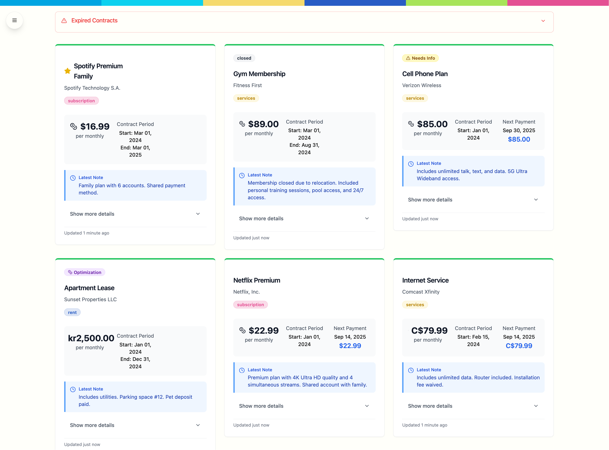

# contracts

Organize contracts, maintain visibility, and track your spendings.

## 🚀 Live Demo

**Try it out now!** Visit our live demo at: [https://la3mmchen.github.io/contracts](https://la3mmchen.github.io/contracts)

The demo showcases all the features below with sample data. **No installation or API server required!** The app automatically runs in demo mode when deployed to GitHub Pages.

## ✨ Features

- 📝 **Easy Contract Management** - Add, edit, and organize all your contracts in one place
- 🏷️ **Reference Number Tracking** - Store and search important contract identifiers like purchase orders, invoice numbers, and account references
- 💰 **Track Any Currency** - Works with euros (default), dollars, pounds, and 7 other major currencies
- 📊 **Smart Spending Insights** - See where your money goes with beautiful charts and summaries
- 🔍 **Find Anything Fast** - Search contracts by name, company, reference number, or filter by type and status
- 📱 **Works Everywhere** - Use on your phone, tablet, or computer - always looks great
- 📤 **Export Your Data** - Download contracts as markdown files or backup everything at once
- 🔒 **Keep Your Data Safe** - Automatic backups and protection against losing your work
- ⚡ **Always Up to Date** - See your spending totals and upcoming payments in real-time



**⚠️ Data Storage Warning: Contracts are stored as individual JSON files on disk. While this works for personal use, consider backing up your data regularly to prevent potential data loss.**       

## Usage

The project consists of 2 parts: a frontend app and an API that stores your data locally. You can use these container images:

* ghcr.io/la3mmchen/contracts-app:latest
* ghcr.io/la3mmchen/contracts-api:latest

### Example 

You can use `docker-compose.yml` file:

```yaml
name: apps
services:
  frontend:
    image: ghcr.io/la3mmchen/contracts-app:latest
    environment:
      API_URL: "https://contracts.yourdomain.com/api"
      APP_NAME: "contracts"
      # Contract Categories (comma-separated)
      CONTRACTS_CATEGORIES: "subscription,insurance,utilities,rent,services,software,maintenance,other"
      # Contract Statuses (comma-separated)
      CONTRACTS_STATUSES: "active,expired,cancelled,terminated,closed"
      # Contract Frequencies (comma-separated)
      CONTRACTS_FREQUENCIES: "monthly,quarterly,yearly,weekly,bi-weekly,one-time"
      # Supported Currencies (comma-separated)
      CONTRACTS_CURRENCIES: "USD,EUR,GBP,CAD,AUD,JPY,CHF,SEK,NOK,DKK"
    restart: unless-stopped

  backend:
    image: ghcr.io/la3mmchen/contracts-api:latest
    environment:
      PORT: 3001
      CONTRACTS_DATA_DIR: "/data"
      # Authentication (optional): set a single shared password to require
      # login. Leave empty to disable app-level auth (e.g. when relying on
      # reverse-proxy basic auth).
      APP_PASSWORD: "change-me"
      # Secret used to sign session cookies. Use a long random string.
      # If unset, it is derived from APP_PASSWORD.
      SESSION_SECRET: "a-long-random-string"
      # Set to "production" when served over HTTPS so session cookies get the
      # Secure flag.
      NODE_ENV: "production"
      # Comma-separated list of allowed browser origins for CORS with
      # credentials. Empty reflects the request origin.
      APP_ORIGIN: "https://contracts.yourdomain.com"
    volumes:
      - "/data/contracts:/data"
    restart: unless-stopped
```

### Environment Variables Reference

The application supports the following environment variables for customization:

| Variable | Description | Default Values |
|----------|-------------|----------------|
| `CONTRACTS_CATEGORIES` | Contract categories for organization | `subscription,insurance,utilities,rent,services,software,maintenance,other` |
| `CONTRACTS_STATUSES` | Contract status options | `active,expired,cancelled,terminated,closed` |
| `CONTRACTS_FREQUENCIES` | Payment frequency options | `monthly,quarterly,yearly,weekly,bi-weekly,one-time` |
| `CONTRACTS_CURRENCIES` | Supported currencies (EUR is default) | `EUR,USD,GBP,CAD,AUD,JPY,CHF,SEK,NOK,DKK` |

**Note:** All values are comma-separated strings. If an environment variable is not set, the application will use the default values listed above. The default currency for new contracts is EUR.

**Example Custom Configuration:**
```bash
# Custom categories for a specific business
CONTRACTS_CATEGORIES="software,cloud,consulting,training,hardware,maintenance"

# Custom statuses for workflow management
CONTRACTS_STATUSES="draft,pending,active,review,expired,archived"

# Custom frequencies for different business models
CONTRACTS_FREQUENCIES="daily,weekly,monthly,quarterly,annually"

# Custom currencies for international business (EUR is default)
CONTRACTS_CURRENCIES="EUR,USD,GBP,JPY,CNY,INR,BRL"
```

**New Features:**
- **Reference Field**: Each contract now includes an optional reference field for storing important identifiers like purchase order numbers, invoice references, account numbers, etc.
- **EUR Default Currency**: New contracts default to EUR instead of USD
- **Enhanced Search**: Search now includes reference numbers for better contract discovery

## 🔐 Authentication

The app has optional built-in authentication using a **single shared password**.

- **Disabled by default.** If `APP_PASSWORD` is not set on the API, the app behaves as before with no login screen. This keeps local development and the GitHub Pages demo working, and remains compatible with reverse-proxy basic auth.
- **To enable**, set `APP_PASSWORD` on the API (and ideally a long random `SESSION_SECRET`). The frontend then shows a login screen, and all API routes except `/api/health` and `/api/auth/*` require a valid session.

How it works: submitting the password to `POST /api/auth/login` returns an `HttpOnly`, `SameSite=Lax` session cookie holding an HMAC-signed token (stateless, 7-day expiry — no server-side session store). The browser sends it automatically on subsequent requests; a "Log out" action is available in the app menu.

| Variable | Description | Default |
|----------|-------------|---------|
| `APP_PASSWORD` | Shared login password. Empty disables auth. | *(unset — auth disabled)* |
| `SESSION_SECRET` | Secret used to sign session cookies. Use a long random value. | *(derived from `APP_PASSWORD`)* |
| `NODE_ENV` | Set to `production` (served over HTTPS) to add the `Secure` cookie flag. | *(unset)* |
| `APP_ORIGIN` | Comma-separated allowed browser origins for CORS with credentials. Empty reflects the request origin. | *(unset)* |

> **Note:** Because the cookie uses `SameSite=Lax`, the frontend and API should be served under the same site (e.g. both behind one reverse proxy, `/` → frontend and `/api` → backend — the documented production setup). If you must serve them on genuinely different domains, `SameSite=Lax` cookies won't be sent cross-site.

For a reverse-proxy example (nginx + SSL), see the [example configuration](docs/example/).

### Use locally

Instaed of running this on a server you can also just use it locally.

```bash
# Build and run the full application
task run

# Load test data (optional)
task load-test-data

# Check application health
task health
```

Keep in mind: data is stored **Local**: `./data/contracts/` (relative to the path in which you clone the repo)

#### 🔧 Available Commands

When running locally, you can levevarge [Taskfile](https://taskfile.dev/) to execute most of the necessary commands.

```bash
# Docker workflows
task build          # Build Docker images
task run           # Start application
task stop          # Stop containers
task clean         # Clean up everything

# Data management
task load-test-data    # Load sample contracts
task clear-test-data   # Remove test contracts only
task data-info         # Storage information

# Export functionality
task test-export-markdown  # Test Markdown export feature (ZIP and individual files)
task test-backup           # Test backup feature

# Monitoring
task logs          # View all logs
task health        # Service health status
```
**Configuration Changes:**
To change configuration (app name, API URL, categories), simply update the environment variables in `docker-compose.yml` and restart the app container:

```bash
docker compose restart app
```

## 🚀 CI/CD

### GitHub Actions
- **Docker Build & Push**: Automatically builds and pushes Docker images to GitHub Container Registry

### Docker Images
Images are available at:
- **App**: `ghcr.io/la3mmchen/contracts-app`
- **API**: `ghcr.io/la3mmchen/contracts-api`

**Usage:**
```bash
# Pull and run from registry
docker pull ghcr.io/la3mmchen/contracts-app:latest
docker pull ghcr.io/la3mmchen/contracts-api:latest

# Run with custom configuration
docker run -e APP_NAME="My Contracts" -e API_URL="http://api:3001/api" ghcr.io/la3mmchen/contracts-app:latest
```

## 🌐 Access Points

### Development
- **Frontend**: http://localhost:3000
- **API**: http://localhost:3001

### Production
- **Frontend**: https://contracts.yourdomain.com
- **API**: https://contracts.yourdomain.com/api
- **Health Check**: https://contracts.yourdomain.com/api/health

📡 **For complete API documentation, see [API Documentation](docs/api.md)**

The API provides endpoints for:
- **Core Operations**: CRUD operations for contracts
- **Search & Filtering**: Find contracts by various criteria
- **Export & Backup**: Markdown export with filtering options
- **System Information**: Data storage and statistics

## Export 

📤 **See [Export Documentation](docs/export.md) for detailed export functionality**

## Backup 

📤 **See [Backup Documentation](docs/backup.md) for detailed backup functionality**

## 🔧 Environment Variables

### Frontend (Client)
| Variable | Default | Description |
|----------|---------|-------------|
| `APP_NAME` | `contracts` | Application title displayed in header |
| `CONTRACTS_CATEGORIES` | `subscription,insurance,utilities,rent,services,software,maintenance,other` | Comma-separated list of contract categories |
| `CONTRACTS_STATUSES` | `active,expired,cancelled,terminated,closed` | Comma-separated list of contract statuses |
| `CONTRACTS_FREQUENCIES` | `monthly,quarterly,yearly,weekly,bi-weekly,one-time` | Comma-separated list of payment frequencies |
| `CONTRACTS_CURRENCIES` | `EUR,USD,GBP,CAD,AUD,JPY,CHF,SEK,NOK,DKK` | Comma-separated list of supported currencies (EUR is default) |
| `API_URL` | `http://localhost:3001/api` | Backend API endpoint |

### Backend (API)
| Variable | Default | Description |
|----------|---------|-------------|
| `CONTRACTS_DATA_DIR` | `/app/data` | Directory for storing contract JSON files |
| `PORT` | `3001` | API server port |
| `APP_PASSWORD` | *(unset — auth disabled)* | Shared login password. When set, enables app-level authentication |
| `SESSION_SECRET` | *(derived from `APP_PASSWORD`)* | Secret used to sign session cookies. Use a long random value |
| `NODE_ENV` | *(unset)* | Set to `production` (HTTPS) to add the `Secure` flag to session cookies |
| `APP_ORIGIN` | *(unset — reflects origin)* | Comma-separated allowed browser origins for CORS with credentials |

**Example custom configuration:**
```yaml
# docker-compose.yml
environment:
  - APP_NAME=My Contract App
  - API_URL=https://contracts.yourdomain.com/api
  - CONTRACTS_CATEGORIES=subscription,insurance,utilities,rent,services,marketing,legal
  - CONTRACTS_STATUSES=draft,pending,active,review,expired,archived
  - CONTRACTS_FREQUENCIES=daily,weekly,monthly,quarterly,annually
  - CONTRACTS_CURRENCIES=EUR,USD,GBP,JPY,CNY,INR,BRL
(...)
environment:

  - CONTRACTS_DATA_DIR=/app/data
```

**Runtime Configuration:**
The frontend uses runtime configuration loaded from environment variables. Configuration is generated automatically when the container starts, so no rebuilds are needed for configuration changes.

### Production Configuration Tips

**1. API URL Configuration:**
- Use `https://` for production (not `http://`)
- Include the full domain: `https://contracts.yourdomain.com/api`
- Ensure the domain matches your SSL certificate

**2. Data Persistence:**
- Mount `/data/contracts:/data` to persist contract data
- Ensure proper permissions: `chmod 755 /data/contracts`

**3. Security:**
- Enable the built-in authentication by setting `APP_PASSWORD` (and a random `SESSION_SECRET`) on the API; set `NODE_ENV=production` and `APP_ORIGIN` when served over HTTPS. See [Authentication](#-authentication).
- Alternatively (or additionally) use basic authentication with nginx
- Enable SSL/TLS encryption
- Consider using environment-specific `.env` files

**4. Monitoring:**
- Check container logs: `docker compose logs -f contracts_app`
- Monitor API health: `curl https://contracts.yourdomain.com/api/health`
- Verify data persistence: `ls -la /data/contracts/`

## 🏗️ Project Structure

```
contracts/
├── client/          # Frontend React application
├── api/            # Backend Express API
├── test-data/      # Sample contract data
├── docs/           # Documentation
├── docker-compose.yml
└── Taskfile.yml    # Development workflows
```

### 📚 Documentation
- **README.md** - Project overview and quick start
- **[API Documentation](docs/api.md)** - Complete API reference and examples
- **[API Schema](docs/api-schema.md)** - Comprehensive API schema and data types
- **[Export Documentation](docs/export.md)** - Detailed export functionality guide
- **[Backup Documentation](docs/backup.md)** - Backup functionality guide
- **[Example Configuration](docs/example/)** - Docker and nginx setup examples
