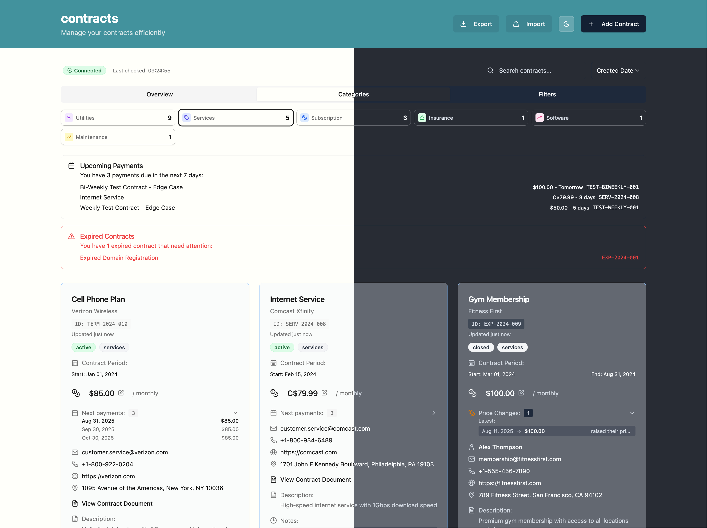

# contracts

Organize contracts, maintain visibility, and track your spendings.

**⚠️ Data Storage Warning: Contracts are stored as individual JSON files on disk. While this works for personal use, consider backing up your data regularly to prevent potential data loss.**       




## features

- **Contract Management**: Create, edit, and delete contracts with detailed information
- **Multi-Currency Support**: Track contracts in USD, EUR, GBP, CAD, AUD, JPY, CHF, SEK, NOK, DKK
- **Payment Tracking**: Automatic calculation of next payment dates and upcoming payments
- **Analytics Dashboard**: Visual charts showing spending breakdown, contract categories, and status distribution
- **Search & Filtering**: Find contracts by name, company, status, or category
- **Export Functionality**: Export contracts to Markdown format for backup
- **Responsive Design**: Works on desktop and mobile devices
- **Local Data Storage**: JSON-based file storage for data persistence
- **Real-time Statistics**: Live updates of monthly/yearly spending and contract counts

## Usage

The project consists of 2 parts: a frontend app and an API that stores your data locally. You can use these container images:

* ghcr.io/la3mmchen/contracts-app:latest
* ghcr.io/la3mmchen/contracts-api:latest

### Example 

You can use `docker-compose.yml` file:

```yaml
name: apps
services:
  frontend:
    image: ghcr.io/la3mmchen/contracts-app:latest
    environment:
      API_URL: "https://contracts.yourdomain.com/api"
      APP_NAME: "contracts"
      CONTRACTS_CATEGORIES: "subscription,insurance,utilities,rent,services,software,maintenance,other"
    restart: unless-stopped

  backend:
    image: ghcr.io/la3mmchen/contracts-api:latest
    environment:
      PORT: 3001
      CONTRACTS_DATA_DIR: "/data"
    volumes:
      - "/data/contracts:/data"
    restart: unless-stopped
```

We don't bring any authentication in the app or api yet, so help yourself with basic auth if you want to use this over the internet.

A comprehensive example is [here](.docs/example).

### Use locally

Instaed of running this on a server you can also just use it locally.

```bash
# Build and run the full application
task run

# Load test data (optional)
task load-test-data

# Check application health
task health
```

Keep in mind: data is stored **Local**: `./data/contracts/` (relative to the path in which you clone the repo)

## 🔧 Available Commands

```bash
# Docker workflows
task build          # Build Docker images
task run           # Start application
task stop          # Stop containers
task clean         # Clean up everything

# Data management
task load-test-data    # Load sample contracts
task clear-test-data   # Remove test contracts only
task data-info         # Storage information

# Export functionality
task test-export-markdown  # Test Markdown export feature

# Monitoring
task logs          # View all logs
task health        # Service health status
```

**Configuration Changes:**
To change configuration (app name, API URL, categories), simply update the environment variables in `docker-compose.yml` and restart the app container:
```bash
docker compose restart app
```

### Production Commands

```bash
# Deploy to production
docker compose up -d

# Update configuration
docker compose restart contracts_app

# Check service status
docker compose ps

# View logs
docker compose logs -f contracts_app
docker compose logs -f contracts_api

# Backup contracts
cp -r /data/contracts /backup/contracts-$(date +%Y%m%d)

# Restore contracts
cp -r /backup/contracts-20241201/* /data/contracts/
```

## 🚀 CI/CD

### GitHub Actions
- **Docker Build & Push**: Automatically builds and pushes Docker images to GitHub Container Registry
- **Testing**: Runs tests and verifies Docker builds on every push/PR

### Docker Images
Images are available at:
- **App**: `ghcr.io/la3mmchen/contracts-app`
- **API**: `ghcr.io/la3mmchen/contracts-api`

**Usage:**
```bash
# Pull and run from registry
docker pull ghcr.io/la3mmchen/contracts-app:latest
docker pull ghcr.io/la3mmchen/contracts-api:latest

# Run with custom configuration
docker run -e APP_NAME="My Contracts" -e API_URL="http://api:3001/api" ghcr.io/la3mmchen/contracts-app:latest
```

## 🌐 Access Points

### Development
- **Frontend**: http://localhost:3000
- **API**: http://localhost:3001

### Production
- **Frontend**: https://contracts.yourdomain.com
- **API**: https://contracts.yourdomain.com/api
- **Health Check**: https://contracts.yourdomain.com/api/health

## 📡 API Endpoints

### Core Contract Operations
- `GET /api/contracts` - Get all contracts
- `GET /api/contracts/:id` - Get contract by ID
- `POST /api/contracts` - Create new contract
- `PUT /api/contracts/:id` - Update contract
- `DELETE /api/contracts/:id` - Delete contract

### Search & Filtering
- `GET /api/contracts?search=query` - Search contracts
- `GET /api/contracts?status=active` - Filter by status

### Export & Backup
- `GET /api/contracts/export/markdown` - Export all contracts to Markdown
- `GET /api/contracts/export/markdown?status=active` - Export filtered contracts

### System Information
- `GET /api/contracts/info/data` - Data storage information
- `GET /api/contracts/info/stats` - File statistics

**Example API usage:**
```bash
# Export all contracts to Markdown file
curl -o contracts-backup.md http://localhost:3001/api/contracts/export/markdown

# Export only active contracts
curl -o active-contracts.md "http://localhost:3001/api/contracts/export/markdown?status=active"

# Search and export matching contracts
curl -o search-results.md "http://localhost:3001/api/contracts/export/markdown?search=netflix"
```

## 🔧 Environment Variables

### Frontend (Client)
| Variable | Default | Description |
|----------|---------|-------------|
| `APP_NAME` | `contracts` | Application title displayed in header |
| `CATEGORIES` | `subscription,insurance,utilities,rent,services,software,maintenance,other` | Comma-separated list of contract categories |
| `API_URL` | `http://localhost:3001/api` | Backend API endpoint |

### Backend (API)
| Variable | Default | Description |
|----------|---------|-------------|
| `CONTRACTS_DATA_DIR` | `/app/data` | Directory for storing contract JSON files |
| `PORT` | `3001` | API server port |

**Example custom configuration:**
```yaml
# docker-compose.yml
environment:
  - APP_NAME=My Contract App
  - CATEGORIES=subscription,insurance,utilities,rent,services,marketing,legal
  - API_URL=https://contracts.yourdomain.com/api
  - CONTRACTS_DATA_DIR=/app/data
```

**Runtime Configuration:**
The frontend uses runtime configuration loaded from environment variables. Configuration is generated automatically when the container starts, so no rebuilds are needed for configuration changes.

### Production Configuration Tips

**1. API URL Configuration:**
- Use `https://` for production (not `http://`)
- Include the full domain: `https://contracts.yourdomain.com/api`
- Ensure the domain matches your SSL certificate

**2. Data Persistence:**
- Mount `/data/contracts:/data` to persist contract data
- Ensure proper permissions: `chmod 755 /data/contracts`

**3. Security:**
- Use basic authentication with nginx
- Enable SSL/TLS encryption
- Consider using environment-specific `.env` files

**4. Monitoring:**
- Check container logs: `docker compose logs -f contracts_app`
- Monitor API health: `curl https://contracts.yourdomain.com/api/health`
- Verify data persistence: `ls -la /data/contracts/`

## 🏗️ Project Structure

```
contracts/
├── client/          # Frontend React application
├── api/            # Backend Express API
├── test-data/      # Sample contract data
├── docker-compose.yml
└── Taskfile.yml    # Development workflows
```
